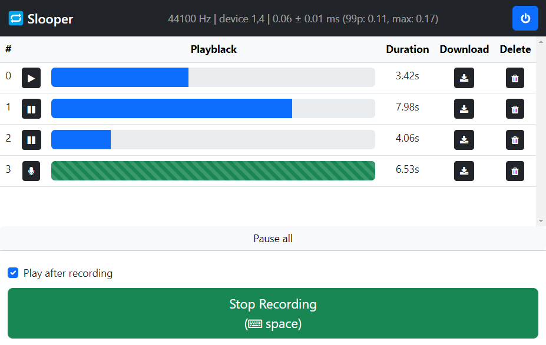

# 🔁 Slooper

[](https://github.com/jw3il/slooper/actions/workflows/lint.yml) 
[](https://github.com/psf/black)
[](https://github.com/prettier/prettier)

*Slooper* is a web-based audio recording and playback tool tailored for looping.
Its main purpose is to add looping functionality to guitar amps with USB audio interfaces.

Connect it to your amp with a Raspberry Pi, your Laptop or PC and control the slooper from any device in your network.
The audio is recorded locally, the recording delay can be adapted according to your device's hardware.
As slooper uses the USB audio interface, nothing stops you from simultaneous playback and recording.
Compared to microphone-based solutions, all recordings come straight from your amp without any additional noise.



## Features

- [x] Local audio recording
- [x] Web-based interface
- [x] Simultaneous playback of multiple recordings
- [x] Record during playback
- [x] Download recordings
- [x] Consistent over multiple devices
- [x] Minimalistic UI
- [ ] Control volume per recording
- [ ] Fast loop transition to avoid audio popping
- [ ] Trim recordings

## Supported Devices

In theory, slooper supports all audio devices that are visible to your operating system.

Slooper has been tested with the following audio devices & systems:

| Audio Device                   | Hardware               | Comments | 
|--------------------------------|------------------------|----------|
| Positive Grid Spark Guitar Amp | Raspberry Pi 1 Model B | TODO     |

## Installation

Slooper is based on Python 3.10. You can use your system's Python installation or create a virtual environment (e.g. via miniconda):

```
$ conda create -n slooper python=3.10
$ conda activate slooper
(slooper) $
```

Next, clone the repository and set it as your working directory.

```
(slooper) $ git clone git@github.com:jw3il/slooper.git
(slooper) $ cd slooper
```

You can install the project in editable mode with `pip`:

```
(slooper) $ pip install -e .
```

This will set up the project. The dependencies have additional runtime requirements that may or may not be installed on your system. 
On a fresh installation of `Raspbian GNU/Linux 11 (bullseye)`, you have to install `libatlas-base-dev` for `numpy` and `libportaudio2` and `libsndfile1-dev` for `sounddevice`:

```
$ sudo apt install libatlas-base-dev libportaudio2 libsndfile1-dev
```

In your python environment, you should now be able to run slooper in development mode:
```
(slooper) $ slooper -d
```

On the first launch, this will create a slooper configuration file at `~/.slooper`. You can specify a different location by setting the environment variable `$SLOOPER_CONF`. You can customize the config, e.g. to select your desired audio devices for recording and playback.

Congratulations, you are ready to go!

## Running Slooper

Slooper comes with the helper script `slooper` to run it in different modes.

### Production Mode

Execute `slooper -p` to run the app in production mode with [waitress](https://docs.pylonsproject.org/projects/waitress/en/stable/index.html).
We recommend to use this mode for playing with slooper, as the UI latency will usually be much lower than in development mode. 

If you want to use slooper on multiple devices simultaneously, you can enable the experimental websocket support with [gevent](http://www.gevent.org/) by running `slooper -pw`.
Note that, depending on your hardware, this can increase the latency.

###  Development Mode

Execute `slooper -d` to run the app in development mode with the built-in flask development server.
Note that this webserver is quite slow, only use this option for development.

###  Systemd Service

Execute `slooper -i` to create and enable the slooper service to run slooper at system startup.
You can find more service-related arguments with `slooper --help`.

## Additional System Configuration

### Poweroff and usbreset (Linux only)

Slooper includes some system functionality that requires root permissions:

* It has a button to power off your system. This button simply calls `sudo poweroff` on the server. 
* It can reset usb devices before searching for them. This helps finding usb devices that require replugging to be detected. This requires you to install `usbutils` on the target machine, e.g. `sudo apt-get install usbutils `. Slooper then calls `sudo usbreset $ID` for all device ids provided in its config file. You can view your device ids with `lsusb`, they consist of two 16-bit hex values and look like `abcd:abcd`.

To make this work, you can edit `/etc/sudoers` with `visudo` and allow your user `user_name` to execute the commands without user interaction.

```
user_name ALL=(ALL) NOPASSWD: /sbin/poweroff, /usr/bin/usbreset
```

## Contributing

You found a bug or have an idea?
Contributions are welcome, just open a new issue or create a pull request.

All development requirements can be installed with:

```
(slooper) $ pip install -r requirements.txt
```

The project uses [black](https://github.com/psf/black) and [prettier](https://github.com/prettier/prettier) for formatting and [flake8](https://github.com/PyCQA/flake8) for linting.
You can install corresponding pre-commit hooks via:

```
(slooper) $ pre-commit install
```

We provide default project settings and recommended extensions for vscode.